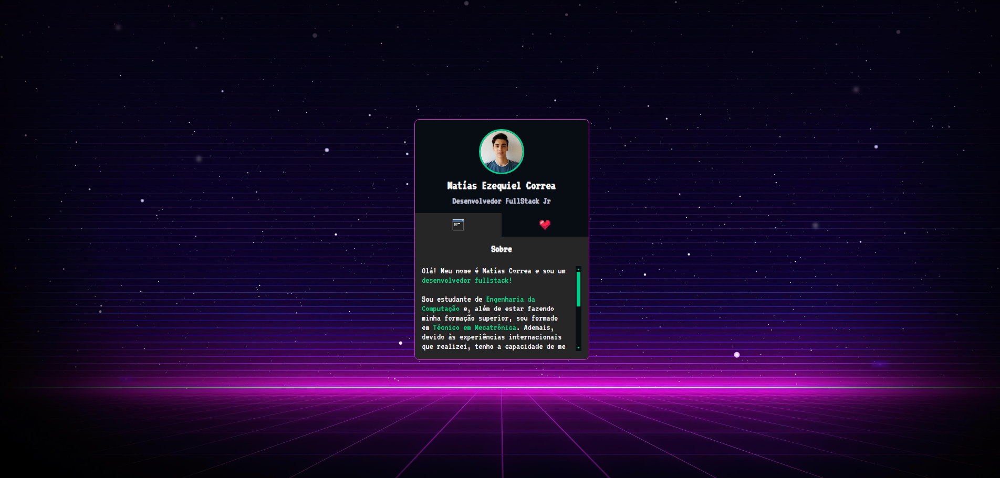
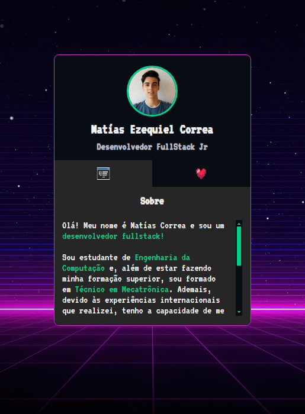

  

<h1 align="center">
  Matías Correa - Mini Portfólio   
</h1>

  Este é um mini portfólio pessoal <a href="https://matias-ezequiel-correa.github.io/mini-portfolio-MatiasCorrea/" target="_blank">Matías Correa - Mini Portfólio,</a> é um website que
 contém informações sobre mim e links das minhas redes sociais, atualmente hospedado no <a href="https://github.com/matias-ezequiel-correa">GitHub-Pages</a>.

## Desing: 
* Desktop:
[
](https://matias-ezequiel-correa.github.io/mini-portfolio-MatiasCorrea/)

* Mobile:
[
](https://matias-ezequiel-correa.github.io/mini-portfolio-MatiasCorrea/)

### 🔗 Link do Portfólio: <a href="https://matias-ezequiel-correa.github.io/mini-portfolio-MatiasCorrea/" target="_blank">matias-ezequiel-correa.github.io/mini-portfolio-MatiasCorrea/</a>

## Tecnologias utilizadas:

 * HTML
 * CSS
 * JAVASCRIPT

 ### Pra entrar em contato, veja as redes abaixo!
 

 
  
  
   

